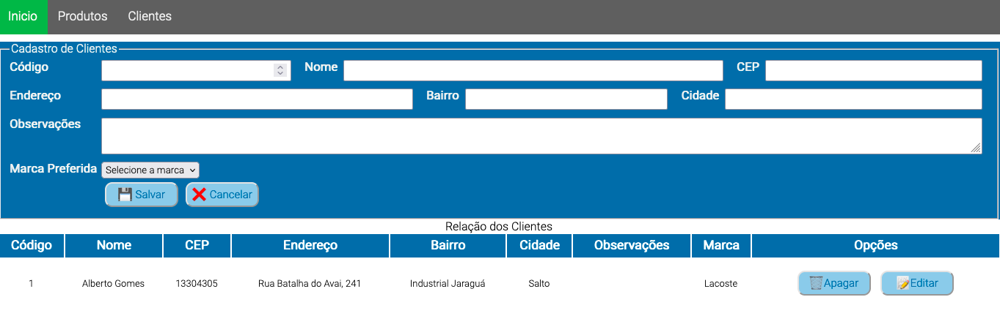

# Cadastro HTML com LocalStorage

## Descrição


Este projeto demonstra como criar um formulário de cadastro simples usando HTML e CSS.

## Funcionalidades

* O formulário permite que o usuário digite seus dados básicos.
* Os dados inseridos pelo usuário são validados antes de serem enviados.
* Uma mensagem de sucesso ou erro é exibida após o envio do formulário.

## Tecnologias utilizadas

* HTML5
* CSS3
* JavaScript

## Instalação

1. Clone o repositório para o seu computador:
````
git clone https://github.com/ricardoleme/cadastroHTML.git
````

2. Acesse a pasta do projeto:
````
cd cadastroHTML
````

3. Abra o arquivo `index.html` em um navegador web.

## Uso

1. Preencha os campos do formulário com seus dados.
2. Clique no botão "Enviar".
3. Uma mensagem de sucesso ou erro será exibida.


## Observações

* Este projeto é apenas um exemplo simples de como criar um formulário de cadastro.
* Você pode personalizar o formulário de acordo com suas necessidades.

## Licença

Este projeto está licenciado sob a licença MIT.

## Contribuições

São bem-vindas contribuições para este projeto. Para contribuir, faça um fork do repositório e envie um pull request.

## Agradecimentos

Agradeço a todos que contribuíram para este projeto.

## Links

* Repositório GitHub: https://github.com/ricardoleme/cadastroHTML
* Exemplo online: https://github.com/ricardoleme/cadastroHTML/blob/master/index.html

## Contato

Ricardo Leme

* E-mail: ricardo.leme@fatec.sp.gov.br

## Palavras-chave

* HTML
* CSS
* JavaScript
* Formulário
* Cadastro
* Validação
